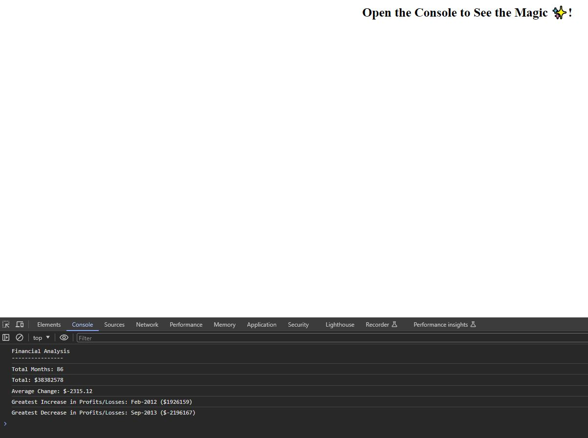

# Unit 4 Challenge: Console Finances

Welcome to the repository for my Console Finances Unit 4 challenge.

## Overview

In this challenge I'll be using the concepts I've learnt to complete the required activity. The activity presents a real-world situation in which my newfound JavaScript skills will come in handy. I am tasked with creating code for analysing the financial records of a company. I've been provided with a financial dataset of the company's month-to-month bookkeeping records.

## Technologies Used

* HTML5
* JavaScript

## Project Structure

* index.html - The html file contains minimal offerings in this project as the bulk of the work is held within the JavaScript file.
* index.js - The main feature of the project, where I have used JS to calculate the required criteria for the project.

## Instructions/demo for user

1. Open the page from the [deployed link]() See below image for reference:

2. When you have the page open, right click on any blank space on the page and press "Inspect" (or press Ctrl + Shift + I for a shortcut).
3. Within the inspection tool, press the "Console" tab which is located between the "Elements" and "Sources" tabs.
4. This is where you'll find the console print out of the required financial analysis criteria for the company.


## Contact

Feel free to contact me if you have any questions or just want to connect:
* [Click here to email me!](mailto:aaronarmstrong1490@gmail.com)
* [Connect with me on LinkedIn](https://www.linkedin.com/in/aaron-armstrong-%E8%89%BE%E4%BF%8A%E6%A8%82-80986ba5/)


## Links

* [Link to the code repository on Github](https://github.com/aaron1490/Console-Finances)
* [Link to the deployed page]()


## Instructions I was provided with

1. Create a new GitHub repo called `Console-Finances`. Then, clone it to your computer.

2. Copy the starter files in your local git repository.

You have been given a dataset composed of arrays with two fields, Date and Profit/Losses.

Your task is to write JavaScript code that analyzes the records to calculate each of the following:

* The total number of months included in the dataset.

* The net total amount of Profit/Losses over the entire period.

* The average of the **changes** in Profit/Losses over the entire period.
  * You will need to track what the total change in Profit/Losses are from month to month and then find the average.
  * (`Total/(Number of months - 1)`)

* The greatest increase in Profit/Losses (date and amount) over the entire period.

* The greatest decrease in Profit/Losses (date and amount) over the entire period.

When you open your code in the browser your resulting analysis should look similar to the following:

  ```text
  Financial Analysis 
  ----------------
  Total Months: 86
  Total: $38382578
  Average Change: -2315.12
  Greatest Increase in Profits/Losses: Feb-2012 ($1926159)
  Greatest Decrease in Profits/Losses: Sep-2013 ($-2196167)
  ```

Your final code should print the analysis to the console.

**Hints:**

* You will need to do some research on your own for this project!

* Remember, in order to combine strings and variables in the console you will need to use **concatenation**.

* How do you only print to the nearest 100th in JavaScript?

## Grading Requirements

This homework is graded based on the following criteria:

### Technical Acceptance Criteria: 40%

* Satisfies all of the above acceptance criteria.

### Deployment: 32%

* Application deployed at live URL.

* Application loads with no errors.

* Application GitHub URL submitted.

* GitHub repository contains application code.

### Repository Quality: 23%

* Repository has a unique name.

* Repository follows best practices for file structure and naming conventions.

* Repository follows best practices for variable naming conventions, indentation, quality comments, etc.

* Repository contains multiple descriptive commit messages.

* Repository contains quality README file with description, screenshot, and link to deployed application.

### Application Quality: 5%

* Application resembles the mock-up functionality provided in the Challenge instructions.

## Review

You are required to submit BOTH of the following for review:

* The URL of the deployed application.

* The URL of the GitHub repository that contains your code. Give the repository a unique name and include a README file that describes the project.

---

## Copyright

© 2023 edX Boot Camps LLC. Confidential and Proprietary. All Rights Reserved.
